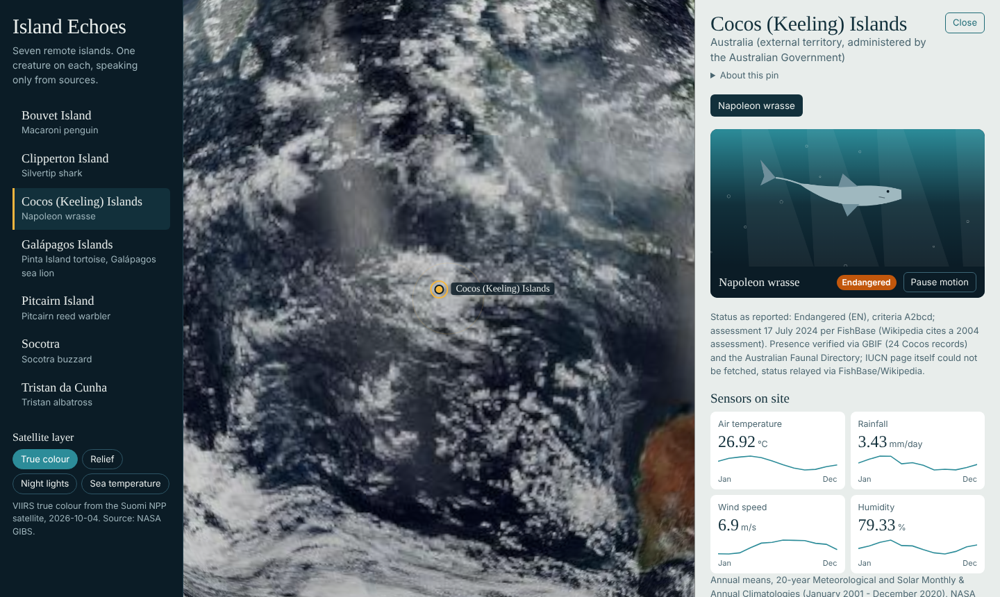
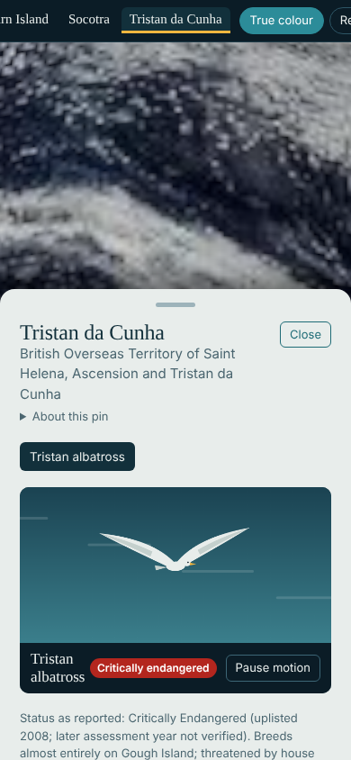
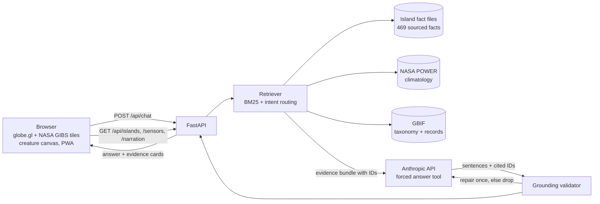

# Island Echoes

A 3D globe of seven remote islands. On each one, an endangered or extinct creature reports in as a
sensor-equipped field agent and answers questions in the first person, using only facts it can cite.



## The problem

Chatbots that role-play animals are charming and unreliable. Ask a talking tortoise about its diet
and you get a confident paragraph with no way to tell which parts are real. For species on the edge
of extinction, that is the wrong failure mode: invented facts about a vanishing animal are worse than
silence.

Island Echoes treats the creature as a voice, not an authority. Every island has a searchable library of
sourced facts (species, water and ocean, climate, ecology, history). Each entry shows its source, and a search
that the sources cannot answer returns nothing instead of a guess. An optional chat lets the creature answer in
the first person: every factual sentence must cite a retrieved source, and a mechanical validator checks those
citations before anything reaches the screen.

## What is in it

| Islands | Creature (type) | Status as reported |
|---|---|---|
| Cocos (Keeling) Islands | Napoleon wrasse (marine) | Endangered |
| Galápagos Islands | Pinta Island tortoise (reptile) | Extinct |
| Galápagos Islands | Galápagos sea lion (mammal) | Endangered |
| Socotra | Socotra buzzard (bird) | Vulnerable |
| Tristan da Cunha | Tristan albatross (bird) | Critically endangered |
| Pitcairn Island | Pitcairn reed warbler (bird) | Endangered |
| Clipperton Island | Silvertip shark (marine) | Vulnerable |
| Bouvet Island | Macaroni penguin (bird) | Vulnerable |

- **Globe**: [globe.gl](https://globe.gl) with NASA GIBS imagery (true colour, relief, night lights, sea surface temperature). Click a pin or pick an island from the list to fly there.
- **Creatures**: four procedural canvas animations (bird, marine, reptile, mammal) and one spoken field report per creature (browser speech synthesis). A pause control stops all motion; reduced-motion preferences start paused.
- **Sensors**: the readouts beside each creature are NASA POWER 20-year climatology (temperature, rainfall, wind, humidity) for that island's grid cell, with a monthly trace.
- **Library**: search each island's sourced facts or filter by category (species, water and ocean, climate, ecology, threats, history and more). Climate and species searches also pull live NASA POWER and GBIF entries. No API key needed.
- **Chat (optional)**: shown only when the server has an `ANTHROPIC_API_KEY`. Answers show numbered citations and the evidence cards behind them.
- **PWA**: installable, with an offline app shell.



## Architecture



**Grounding rules, enforced in code (`app/chat/grounding.py`):**

1. Retrieval is scoped to the selected island and creature. Each evidence item has a stable ID such as `SOC-011`, `POWER-SOC-TEMP` or `GBIF-GAL-galapagos-sea-lion-OCC`.
2. The model must answer through a structured tool: sentences marked `fact` or `voice`, each fact with the IDs it cites.
3. A fact sentence is rejected if it has no citation, cites an ID that was not retrieved, contains a number that is not in the cited evidence, or names a person or place that is not in the cited evidence or the question.
4. Voice sentences (the persona) are capped at 14 words and may not contain digits or names.
5. Rejected sentences go back to the model once with feedback. Anything still failing is dropped. If nothing survives, the reply is a fixed "not in my sources" line.
6. Source conflicts are stored as separate facts, so the creature reports both values and says they differ.
7. Questions that share no words with the island's sources are refused without calling the model.

## Data sources

Only public sources are used. No keys are needed for any of them.

- **Island fact files** (`data/islands/*.json`): 469 facts across seven islands, each with a source URL, publisher, retrieval date and a confidence label. Compiled from public sources including government and agency pages, UNESCO, BirdLife, FishBase, GBIF and Wikipedia. Gaps and conflicts are listed in each file.
- **NASA POWER**: climatology API, 2001 to 2020, snapshotted in `data/snapshots/power/`.
- **GBIF**: species match and occurrence counts, snapshotted in `data/snapshots/gbif/`.
- **NASA GIBS**: satellite imagery tiles, loaded by the browser.

Snapshots are committed so the app and the eval work offline. Live data is refreshed after 30 days (`SOURCE_TTL_DAYS`), with stale fallback if the network fails.

> IUCN Red List pages could not be fetched while compiling the facts. Conservation statuses are therefore shown as "reported by" the secondary sources named on each fact, and are not presented as official IUCN assessments.

## Run it locally

```bash
git clone https://github.com/hudasol/island-echoes && cd island-echoes
make run
```

That creates a virtualenv, installs dependencies, copies `.env.example` to `.env` and starts the server at <http://localhost:8000>. The globe, sensors, field reports and the library work with no keys. To enable the optional chat, put your key in `.env`:

```
ANTHROPIC_API_KEY=your-key-here
```

`.env` is git-ignored. Other commands: `make test`, `make lint`, `make validate` (checks every fact file), `make snapshot` (refreshes POWER and GBIF snapshots), `make eval`.

## Evaluation

`eval/questions.jsonl` holds 30 questions: 11 single-fact, 4 multi-fact, 4 climate (NASA POWER), 2 species (GBIF), 4 source conflicts, 4 unanswerable, and 1 prompt-injection attempt. Each lists the evidence IDs that should support the answer, a regex the answer must satisfy, and whether the creature should refuse.

`make eval` runs the full pipeline (retrieval, model, validator) and then an LLM judge that grades each fact sentence against only its cited evidence. It reports, with 95% Wilson intervals:

- **Groundedness**: share of fact sentences the judge finds supported by their cited evidence.
- **Hallucination rate**: share of fact sentences that are unsupported or contradicted, counting an answer that should have refused but did not.
- Citation validity, expected-evidence recall, refusal accuracy, and how often the validator had to repair a draft.

Results are written to `eval/results/latest.json` and `latest.md`. `make eval-offline` re-scores a saved run without calling the API.

**Current results.** The full model-in-the-loop eval has not been run yet, because it needs an Anthropic API key and none was available when this was built. No groundedness or hallucination numbers are claimed here. What has been measured without a model:

| Check (no model involved) | Result |
|---|---|
| Questions where every expected evidence ID is retrieved | 25 of 25 |
| Unanswerable questions refused before reaching the model | 1 of 5 |

The 25 of 25 recall is not an independent result: the retrieval synonyms and category rules were tuned while writing these questions, so it overstates how the retriever will do on new questions. The other four unanswerable questions rely on the model and validator to refuse, which is what the full eval is for. This section will be replaced with real numbers, including failures, after the first full run.

## Deploy

The repository includes a Render blueprint (`render.yaml`): one web service serves both the API and the static app. Create a Blueprint from this repo, then set `ANTHROPIC_API_KEY` in the Render dashboard. The public chat endpoint has a per-IP limit (10 per minute) and a daily cap (400 requests, `CHAT_DAILY_CAP`) to bound cost.

## Project layout

```
app/        FastAPI app: routes, retrieval, grounding validator, LLM client, sensors
data/       islands/*.json fact files, snapshots/ (NASA POWER, GBIF)
eval/       30 questions, metrics, LLM judge, runner
scripts/    snapshot_sources.py, validate_data.py
web/        globe frontend, creature animations, service worker, manifest, vendored globe.gl
tests/      146 tests (retrieval, grounding, API, sensors, web assets, eval metrics)
docs/       PLAN.md and screenshots
```

## Retrospective

**What went wrong**

- **A second research pass needed a second check.** The 182 library facts added later (species, water, climate, ecology) came from fetch tools that return page summaries rather than raw text. An independent re-read of every one found 26 statements that overstated or mixed up their source (for example two bird population figures swapped), and they were corrected before publishing. Facts that rest on Wikipedia alone are labelled medium confidence in the UI.
- **The island files did not exist.** The brief assumed a set of attached island files. There were none, so the fact base had to be researched from scratch. That took the largest share of the work and left many facts at medium confidence because they rest on a single secondary source.
- **IUCN pages were unreachable** from the research environment, so statuses come second-hand. This is stated in the UI and on every creature.
- **A relevance threshold on retrieval was the wrong gate.** The first design refused any question whose best BM25 score fell below a cut-off. It refused good questions phrased unusually and passed bad ones. It was replaced by a narrow rule (refuse only on zero word overlap) and the model plus validator handle the rest.
- **Naive stemming broke matches** ("tortoises" against "tortoise"), and first-person questions ("what do you eat?") pulled in evidence about the wrong topic when I anchored them to the creature name. Both were fixed with tests.
- **Some sources disagree** (population figures, assessment years). These are kept as separate facts rather than merged, which makes answers longer but honest.

**Assumptions**

- A sentence is grounded if its numbers and names appear in the evidence it cites. This catches invented figures and names cheaply, but it cannot catch a wrong claim built from correct words. That is why the LLM judge exists in the eval.
- One representative creature per island (two on the Galápagos), chosen because presence on or near the island is verifiable in GBIF.
- NASA POWER's coarse grid cell is a fair stand-in for an island's climate. For tiny islands such as Clipperton it is an approximation, and the sensor note shows the cell used.
- Anthropic's model is called through a forced tool, so output shape is guaranteed but content is not.

**What I would redesign**

- Store claims, not paragraphs: break each fact into atomic statements so the validator can check meaning, not only numbers and names.
- Replace keyword retrieval with a small embedding index, keeping BM25 as the fallback, and measure the difference on a held-out question set.
- Add a second, independent verifier model call for every answer instead of only in the eval.
- Pull Red List statuses from the official API once a token is available.
- Run the eval in CI on every change to the fact files.

## Credits and licence

NASA POWER, NASA GIBS and GBIF provide the open data. [globe.gl](https://github.com/vasturiano/globe.gl) (MIT) is vendored in `web/vendor/`. Code is released under the MIT licence (see `LICENSE`). Fact sources are linked on each fact and retain their own licences.
