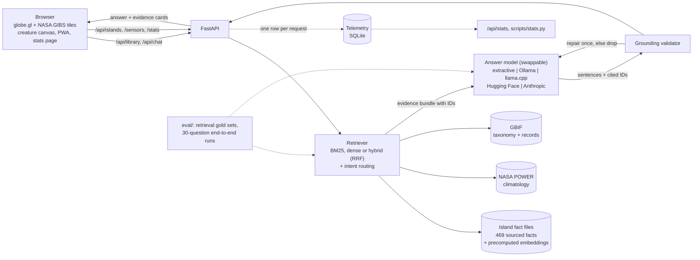

# Island Echoes

A 3D globe of seven remote islands. On each one, an endangered or extinct creature reports in as a
sensor-equipped field agent and answers questions in the first person, using only facts it can cite.


## The problem

Chatbots that role-play animals are charming and unreliable. Ask a talking tortoise about its diet
and you get a confident paragraph with no way to tell which parts are real. For species on the edge
of extinction, that is the wrong failure mode: invented facts about a vanishing animal are worse than
silence.

Island Echoes treats the creature as a voice, not an authority. Every island has a searchable library of
sourced facts (species, water and ocean, climate, ecology, history). Each entry shows its source, and a search
that the sources cannot answer returns nothing instead of a guess. An optional chat lets the creature answer in
the first person: every factual sentence must cite a retrieved source, and a mechanical validator checks those
citations before anything reaches the screen.

## What is in it

| Islands | Creature (type) | Status as reported |
|---|---|---|
| Cocos (Keeling) Islands | Napoleon wrasse (marine) | Endangered |
| Galápagos Islands | Pinta Island tortoise (reptile) | Extinct |
| Galápagos Islands | Galápagos sea lion (mammal) | Endangered |
| Socotra | Socotra buzzard (bird) | Vulnerable |
| Tristan da Cunha | Tristan albatross (bird) | Critically endangered |
| Pitcairn Island | Pitcairn reed warbler (bird) | Endangered |
| Clipperton Island | Silvertip shark (marine) | Vulnerable |
| Bouvet Island | Macaroni penguin (bird) | Vulnerable |

- **Globe**: [globe.gl](https://globe.gl) with NASA GIBS imagery (true colour, relief, night lights, sea surface temperature). Click a pin or pick an island from the list to fly there.
- **Creatures**: four procedural canvas animations (bird, marine, reptile, mammal) and one spoken field report per creature (browser speech synthesis). A pause control stops all motion; reduced-motion preferences start paused.
- **Sensors**: the readouts beside each creature are NASA POWER 20-year climatology (temperature, rainfall, wind, humidity) for that island's grid cell, with a monthly trace.
- **Library**: search each island's sourced facts or filter by category (species, water and ocean, climate, ecology, threats, history and more). Climate and species searches also pull live NASA POWER and GBIF entries. No API key needed.
- **Chat (optional)**: shown when the server has an answer model configured (`LLM_PROVIDER`: a free local model, a free hosted one, a no-model baseline, or Anthropic). Answers show numbered citations and the evidence cards behind them.
- **Statistics**: `/stats.html` and `/api/stats` show usage, answer rate, latency and validator activity; `python -m scripts.stats --csv` exports raw events.
- **PWA**: installable, with an offline app shell.


## Architecture



### Layers

| Layer | Where | Swap with |
|---|---|---|
| Retrieval | `app/data/retrieval.py`, `app/retrieval/` | `RETRIEVAL_MODE=bm25\|dense\|hybrid` |
| Answer model | `app/llm/` | `LLM_PROVIDER=extractive\|ollama\|llamacpp\|huggingface\|openai-compat\|anthropic` |
| Guardrails | `app/chat/grounding.py` | (same checks for every model) |
| Telemetry | `app/telemetry/` | `TELEMETRY=off`, `LOG_QUESTIONS=true` |
| Evaluation | `eval/` | `make eval-retrieval`, `make eval-baseline`, `python -m eval.run_eval --provider ...` |

The design plan is in [docs/LLM_PLAN.md](docs/LLM_PLAN.md).

**Grounding rules, enforced in code (`app/chat/grounding.py`):**

1. Retrieval is scoped to the selected island and creature. Each evidence item has a stable ID such as `SOC-011`, `POWER-SOC-TEMP` or `GBIF-GAL-galapagos-sea-lion-OCC`.
2. The model must answer through a structured tool: sentences marked `fact` or `voice`, each fact with the IDs it cites.
3. A fact sentence is rejected if it has no citation, cites an ID that was not retrieved, contains a number that is not in the cited evidence, or names a person or place that is not in the cited evidence or the question.
4. Voice sentences (the persona) are capped at 14 words and may not contain digits or names.
5. Rejected sentences go back to the model once with feedback. Anything still failing is dropped. If nothing survives, the reply is a fixed "not in my sources" line.
6. Source conflicts are stored as separate facts, so the creature reports both values and says they differ.
7. Questions that share no words with the island's sources are refused without calling the model.

## Data sources

Only public sources are used. No keys are needed for any of them.

- **Island fact files** (`data/islands/*.json`): 469 facts across seven islands, each with a source URL, publisher, retrieval date and a confidence label. Compiled from public sources including government and agency pages, UNESCO, BirdLife, FishBase, GBIF and Wikipedia. Gaps and conflicts are listed in each file.
- **NASA POWER**: climatology API, 2001 to 2020, snapshotted in `data/snapshots/power/`.
- **GBIF**: species match and occurrence counts, snapshotted in `data/snapshots/gbif/`.
- **NASA GIBS**: satellite imagery tiles, loaded by the browser.

Snapshots are committed so the app and the eval work offline. Live data is refreshed after 30 days (`SOURCE_TTL_DAYS`), with stale fallback if the network fails.

> IUCN Red List pages could not be fetched while compiling the facts. Conservation statuses are therefore shown as "reported by" the secondary sources named on each fact, and are not presented as official IUCN assessments.

## Run it locally

```bash
git clone https://github.com/hudasol/island-echoes && cd island-echoes
make run
```

That creates a virtualenv, installs dependencies, copies `.env.example` to `.env` and starts the server at <http://localhost:8000>. The globe, sensors, field reports and the library work with no keys. `.env` is git-ignored. Other commands: `make test`, `make lint`, `make validate` (checks every fact file), `make snapshot` (refreshes POWER and GBIF snapshots), `make stats`, `make report`.

### Turn on the creature chat without paying for an API

Chat appears when `LLM_PROVIDER` is set. Every option runs the same retrieval and the same validator.

```text
LLM_PROVIDER=extractive     # no model: quotes the top sources. Free, instant, a baseline.
LLM_PROVIDER=ollama         # a local model:  ollama pull qwen2.5:3b-instruct
LLM_PROVIDER=huggingface    # free-tier hosted model; HF_TOKEN=<free token>
LLM_PROVIDER=anthropic      # paid API; ANTHROPIC_API_KEY=...
```

For better retrieval, install the optional packages and use embeddings (the vectors are already committed; only the question is embedded at run time):

```bash
pip install -r requirements-ml.txt
RETRIEVAL_MODE=hybrid make run
```

On Windows (PowerShell), the same with Ollama:

```powershell
ollama pull qwen2.5:3b-instruct
.venv\Scripts\pip install -r requirements-ml.txt
$env:LLM_PROVIDER="ollama"; $env:RETRIEVAL_MODE="hybrid"; .venv\Scripts\uvicorn app.main:app --port 8000
```

If a layer cannot start (no `fastembed`, stale vectors, model server down) the app falls back to keyword retrieval and says so in `/api/health`.

### Statistics

Every library lookup and chat turn is logged to a local SQLite file (`data/cache/telemetry.db`): stage latencies, retrieval mode, model, tokens, how many sentences the validator kept, dropped or repaired. The text of questions is **not** stored unless `LOG_QUESTIONS=true`; otherwise only a hash and length are kept.

- `GET /api/stats?days=7`, or the page at `/stats.html`
- `python -m scripts.stats` (readable), `--json`, `--csv events.csv` (for pandas or a spreadsheet), `--url https://island-echoes.onrender.com`

On the free Render plan the file is lost on restart, and `/api/stats` reports when its data starts.

## Evaluation

Three kinds of check, kept separate. Full tables are generated into [docs/RESULTS.md](docs/RESULTS.md) by `make report`; every run is stored in `eval/results/` with its model, retrieval mode, commit and a hash of the facts.

**1. Retrieval** (`make eval-retrieval`). Does the right fact reach the model? 58 held-out questions, paraphrased on purpose so they do not reuse the fact wording, each with gold fact IDs (`eval/retrieval_gold.jsonl`), plus the 19 fact-ID questions of the 30-question set, which the keyword retriever was developed against.

| Held-out set, n=58 | hit@1 | hit@5 | recall@12 | MRR |
|---|---|---|---|---|
| keyword (BM25) | 0.59 | 0.81 | 0.75 | 0.68 |
| dense (bge-small-en-v1.5) | 0.71 | 0.90 | 0.87 | 0.79 |
| hybrid (reciprocal rank fusion) | 0.71 | 0.90 | 0.88 | 0.78 |

Dense and hybrid retrieval find a correct fact more often when the question uses different words from the source. The 95% intervals overlap (for example hit@5 0.81 [0.71-0.91] against 0.90 [0.81-0.97]), so this is a likely gain, not a proven one. On the development questions keyword search is as good or better (hit@5 1.00 against 0.95), which is expected because it was tuned on them. Gold IDs were labelled by one person (the author), so they carry that person's judgement.

**2. End to end, no judge model** (`python -m eval.run_eval --provider <name>`). The 30 questions in `eval/questions.jsonl` (11 single-fact, 4 multi-fact, 4 climate, 2 species, 4 source conflicts, 4 unanswerable, 1 prompt injection) run through retrieval, the model and the validator. Scoring is mechanical: required values present, expected evidence cited, unanswerable questions refused, plus how many of the model's fact sentences the validator had to reject on the first attempt (a proxy for hallucination: invented IDs, numbers or names not in the cited text). Runs checkpoint after every answer and resume if interrupted.

| Run (all on free, local hardware) | passed | key facts | refusal accuracy | false refusals | first-attempt validator failures |
|---|---|---|---|---|---|
| No model: quote the top sources (`extractive`, keyword retrieval) | 15/30 | 26/41 | 1/5 | 0/25 | 0/83 |
| Qwen2.5-3B-Instruct Q4, hybrid retrieval, 8 facts | 14/29 | 25/40 | 4/5 | 10/24 | 12/45 (27%) |

What this says, honestly:

- A 3B model **did not beat quoting the sources** on pass rate (14/29 against 15/30; intervals roughly 31-66% against 33-67%). It added something the baseline cannot do, refusing questions the sources do not cover (4 of 5 against 1 of 5), and paid for it by refusing 10 of 24 answerable questions.
- More than a quarter of its fact sentences failed a check on the first try, mostly wrong or malformed citations and numbers or names not in the cited text. The validator removed them, so nothing unsupported was shown, but the answers got shorter. This is the case the validator is built for.
- One question (Q02) failed because the model returned malformed JSON, and is excluded from the 29.
- With 30 questions the intervals are wide. These numbers are a regression guard and a comparison between configurations, not a benchmark. No LLM judge has been run, so faithfulness beyond the mechanical checks is not measured. Larger models were not run: the Anthropic API needs paid credit, and the free hosted option (`LLM_PROVIDER=huggingface`) needs a token this build did not have. Both are one setting away and produce a row in the same table.

**3. Library relevance** (`pytest tests/test_library_relevance.py`). 106 questions, 52 answerable and 54 not, guard the no-model library search against returning facts for off-topic questions. Part of this set was used for tuning (see "Library search quality").

## Deploy

Live demo: https://island-echoes.onrender.com. It runs on Render's free plan, so the first request after a quiet spell can take up to a minute while the service wakes. The library works without any API key.

The repository includes a Render blueprint (`render.yaml`): one web service serves both the API and the static app. Create a Blueprint from this repo. The deployed instance runs keyword retrieval and no model (the free plan has 512 MB of memory). Setting `LLM_PROVIDER=extractive` in the Render dashboard switches on the no-model chat; a paid provider key is optional. The public chat endpoint has a per-IP limit (10 per minute) and a daily cap (400 requests, `CHAT_DAILY_CAP`) to bound cost.

## Project layout

```
app/            FastAPI app: routes, sensors, rate limiting, security headers
app/data/       fact store, keyword retrieval, NASA POWER and GBIF clients
app/retrieval/  dense retrieval (precomputed embeddings), fusion, retriever factory
app/llm/        answer models behind one interface: extractive, Ollama, llama.cpp, Hugging Face, Anthropic
app/chat/       prompts, grounding validator, chat service
app/telemetry/  per-request SQLite statistics
data/           islands/*.json fact files, snapshots/ (NASA POWER, GBIF), embeddings/
eval/           question sets, retrieval and end-to-end eval, metrics, report, stored results
scripts/        snapshot_sources.py, validate_data.py, build_embeddings.py, stats.py
web/            globe frontend, creature animations, stats page, service worker, vendored globe.gl
tests/          200+ tests (retrieval, dense, providers, grounding, telemetry, API, web assets, eval metrics)
docs/           PLAN.md, LLM_PLAN.md, RESULTS.md and screenshots
```

## Retrospective

**What went wrong**

- **A second research pass needed a second check.** The 182 library facts added later (species, water, climate, ecology) came from fetch tools that return page summaries rather than raw text. An independent re-read of every one found 26 statements that overstated or mixed up their source (for example two bird population figures swapped), and they were corrected before publishing. Facts that rest on Wikipedia alone are labelled medium confidence in the UI, and on 9 October a further check of the 32 High-labelled Wikipedia facts found 14 that needed correcting.
- **The island files did not exist.** The brief assumed a set of attached island files. There were none, so the fact base had to be researched from scratch. That took the largest share of the work and left many facts at medium confidence because they rest on a single secondary source.
- **IUCN pages were unreachable** from the research environment, so statuses come second-hand. This is stated in the UI and on every creature.
- **A relevance threshold on retrieval was the wrong gate.** The first design refused any question whose best BM25 score fell below a cut-off. It refused good questions phrased unusually and passed bad ones. It was replaced by a narrow rule (refuse only on zero word overlap) and the model plus validator handle the rest.
- **Naive stemming broke matches** ("tortoises" against "tortoise"), and first-person questions ("what do you eat?") pulled in evidence about the wrong topic when I anchored them to the creature name. Both were fixed with tests.
- **Some sources disagree** (population figures, assessment years). These are kept as separate facts rather than merged, which makes answers longer but honest.

- **A small local model followed the citation format badly.** The first run of Qwen2.5-3B padded evidence IDs with punctuation (".TDC-019"), so every citation was rejected and the model looked useless. A cleaner for the wrapper characters (the ID itself must still match retrieved evidence) fixed it; a 27% first-attempt failure rate remains, and the model still over-refuses. Measuring before blaming the model mattered.
- **Embeddings helped less than hoped as a gate.** Dense similarity separates answerable from unanswerable questions better than BM25 scores (AUC 0.93 against 0.85 on the 106-question set), but no threshold is clean (at 0.55, 19 of 54 off-topic questions pass), so the library keeps its tuned keyword gate and dense retrieval is used only to rank evidence for the chat.
- **A long eval run was lost** when the sandbox restarted. The runner now checkpoints every answer and resumes.

**Assumptions**

- A sentence is grounded if its numbers and names appear in the evidence it cites. This catches invented figures and names cheaply, but it cannot catch a wrong claim built from correct words. That is why the LLM judge exists in the eval.
- One representative creature per island (two on the Galápagos), chosen because presence on or near the island is verifiable in GBIF.
- NASA POWER's coarse grid cell is a fair stand-in for an island's climate. For tiny islands such as Clipperton it is an approximation, and the sensor note shows the cell used.
- Anthropic's model is called through a forced tool, so output shape is guaranteed but content is not. Local and hosted open models are asked for JSON against a schema, and small ones sometimes return malformed output, which counts as an error.

**What I would redesign**

- Store claims, not paragraphs: break each fact into atomic statements so the validator can check meaning, not only numbers and names.
- Check meaning, not only words, with a small local entailment model, so a wrong claim built from correct words is caught without a paid judge.
- Grow the held-out set and have a second person label the gold fact IDs; 58 questions from one annotator leave wide intervals.
- Try a 7B-class free hosted model and a fine-tuned small model on the citation format, then compare in the same table.
- Add a second, independent verifier model call for every answer instead of only in the eval.
- Pull Red List statuses from the official API once a token is available.
- Run the eval in CI on every change to the fact files.

## Accessibility and data caveats

- An automated axe-core audit (WCAG 2.0 to 2.2 A and AA rules plus best practices) reports no violations on the start screen, both panel tabs, the answer view and the credits dialog, at desktop and phone widths. Automated checks find only part of the problems. No screen-reader or user testing has been done yet.
- Tabs, creature switching and the credits dialog work by keyboard. The island list is a keyboard alternative to the globe. Motion can be paused and `prefers-reduced-motion` is respected.
- Each climate value comes from a NASA POWER grid cell of roughly 0.5 by 0.625 degrees. Every island here is smaller than one cell, so the numbers describe the surrounding area, not a point on the island. The panel says so.
- The confidence label on each fact is the compiler's judgement. On 9 October 2026 the 32 facts that were labelled High but cited Wikipedia were re-checked against primary sources: 14 needed corrections (one more was narrowed), 12 were downgraded to Medium because nothing but Wikipedia backs them, and the rest now cite the primary source. No High fact cites Wikipedia now. The other labels have not been audited independently. Three links that returned HTTP 404 were replaced or downgraded the same day.
- GBIF counts are split into observations, preserved or fossil specimens and living or captive animals, using only records with coordinates and no flagged coordinate issue. For the extinct-in-the-wild Pinta Island tortoise, 22 of its 27 nearby records are specimens.
- When a creature lives away from the point the NASA POWER readings describe (the Pinta Island tortoise), the panel says so.
- If live data replaces an older snapshot and a value moves, the change is logged and listed at `/api/data-changes`.

## Library search quality

The library's search is lexical (BM25 with a small stemmer and hand-written synonyms). A question is answered only when the facts cover enough of its words, and a question that names something the library has never seen, such as a capitalised place or an unfamiliar noun, is refused. Matches that cover only part of a question are labelled as the closest entries.

`eval/library_relevance.jsonl` holds 106 questions (52 the library can answer, 54 it cannot) and `tests/test_library_relevance.py` guards them.

| Measure | Before the fix | After |
|---|---|---|
| Out-of-scope questions that still returned facts (20 questions) | 10 of 20 | 1 of 54 in the saved set |
| Answerable questions that returned nothing | not measured | 0 of 52 in the saved set |
| First run on 42 fresh questions, before tuning on them | | 1 of 20 false positives, 6 of 22 answerable empty |

Both sets were tuned against, so the "after" figures are regression checks, not an independent score. The fresh-question row is the honest estimate: roughly 5% wrong answers to out-of-scope questions and about a quarter of answerable questions missed, before the later fixes for synonyms. A held-out set written by someone else would be a better test.

## Operations

- GitHub Actions runs lint, data validation and the tests on every push against pinned dependencies (`requirements.lock`). A weekly job checks that each fact's source link still resolves.
- Responses carry a Content-Security-Policy that allows scripts only from this site and imagery only from NASA GIBS, plus HSTS over HTTPS, a frame ban and a permissions policy.
- Library and sensor lookups are limited per client (`READ_RATE_PER_MIN`, default 240) and chat has its own limit and daily cap. The client address is the entry added by the nearest trusted proxy (`TRUSTED_PROXY_HOPS`, default 1), so a caller cannot reset the limit by forging `X-Forwarded-For`. If a proxy chain on your host differs, set the variable to match.
- API requests are logged by method, path, status and time. Query strings, which hold what people asked, are not logged.

## Credits and licence

This is an independent project. It is not a NASA product and NASA has not reviewed or endorsed it. We acknowledge the use of imagery provided by services from NASA's Global Imagery Browse Services (GIBS), operated by NASA/GSFC/Earth Science Data and Information System (ESDIS). Climate data were obtained from the NASA Langley Research Center (LaRC) POWER Project, funded through the NASA Earth Science/Applied Science Program. Species records come from GBIF.org. [globe.gl](https://github.com/vasturiano/globe.gl) (MIT) is vendored in `web/vendor/`. Code is released under the MIT licence (see `LICENSE`). Fact sources are linked on each fact and retain their own licences.
