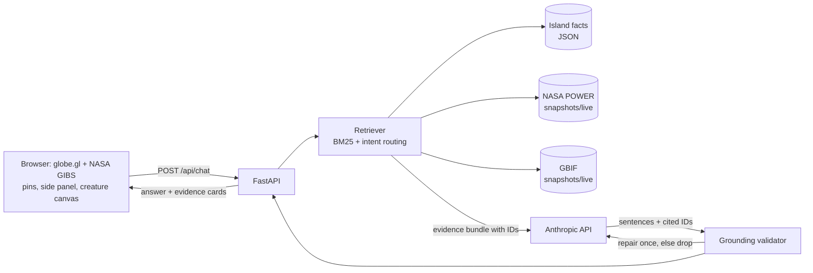

# Island Echoes — build plan

## Goal
A 3D globe with seven remote islands. Click a pin (or pick from the side panel) to zoom in.
Each island has an animated extinct or endangered creature that speaks in the first person, as a
sensor-equipped "analog planet" field agent, and answers questions **only** from retrieved,
cited sources. If the sources don't contain the answer, it says so.

## Islands and creatures
| Island | Creature | Type |
|---|---|---|
| Cocos (Keeling) Islands | Napoleon wrasse | marine |
| Galápagos Islands | Pinta Island tortoise (extinct) · Galápagos sea lion | reptile · mammal |
| Socotra | Socotra buzzard | bird |
| Tristan da Cunha | Tristan albatross | bird |
| Pitcairn Island | Pitcairn reed warbler | bird |
| Clipperton Island | Silvertip shark | marine |
| Bouvet Island | Macaroni penguin | bird |

## Data sources (and only these)
1. **Island fact files** — `data/islands/*.json`. 287 atomic, paraphrased facts, each with a
   source URL, publisher, evidence note and confidence. Compiled from public web sources.
2. **NASA POWER** — monthly climatology (temperature, rainfall, wind, humidity) at each pin.
3. **GBIF** — species backbone match and occurrence counts for each creature.
4. **NASA GIBS** — imagery tiles on the globe (not used as chat evidence).

POWER and GBIF responses are cached as committed snapshots in `data/snapshots/` so the app and the
eval are reproducible and start without network calls; `make snapshot` refreshes them.

## Architecture

## Grounding design
- Retrieval is scoped to the selected island. Each evidence item has a stable ID
  (`SOC-014`, `POWER-SOC-TEMP`, `GBIF-SOC-socotra-buzzard-OCC`).
- The model must return JSON: sentences, each with `cites` (evidence IDs). Pure persona sentences
  ("kind":"voice") are short and may not contain digits or proper nouns.
- The validator rejects a sentence if any cited ID was not retrieved, if it has no citation, or if
  a number in it does not appear in the cited evidence. It asks the model to repair once; any
  sentence still failing is dropped. If nothing survives, the reply is an honest "not in my sources".
- If retrieval confidence is below threshold and no climate/species intent is detected, the app
  refuses without calling the model.
- Source conflicts are kept as separate facts; the creature states both values and says they differ.
- IUCN pages could not be fetched when compiling the facts, so statuses are cited as reported by the
  secondary sources named on each fact.

## Eval
`eval/questions.jsonl`: 30 questions — single-fact, multi-fact, climate (POWER), species (GBIF),
conflict-handling and unanswerable ones. Each lists expected evidence IDs (or `should_refuse`).
`eval/run_eval.py` runs the real pipeline and reports:
- **Groundedness**: share of answer sentences judged supported by their cited evidence
  (deterministic checks plus an LLM judge).
- **Hallucination rate**: share of sentences with unsupported claims, plus answers that should have refused but did not.
- Citation validity, expected-evidence recall, and refusal accuracy.

## Frontend
globe.gl with NASA GIBS WMTS layers (true colour, night lights, sea surface temperature) and a
layer switcher; seven pins; side panel; fly-to animation; creature canvas with four animation types
(bird, marine, reptile, mammal) and one narration each (browser speech synthesis); installable PWA.

## Deploy
Single FastAPI service that also serves the static frontend; Render blueprint (`render.yaml`).
`ANTHROPIC_API_KEY` is set in the host's dashboard, never in the repo.

## Stages
1. Plan (this document)  2. Data layer  3. Chat + eval  4. Globe + PWA  5. README, deploy, demo video
